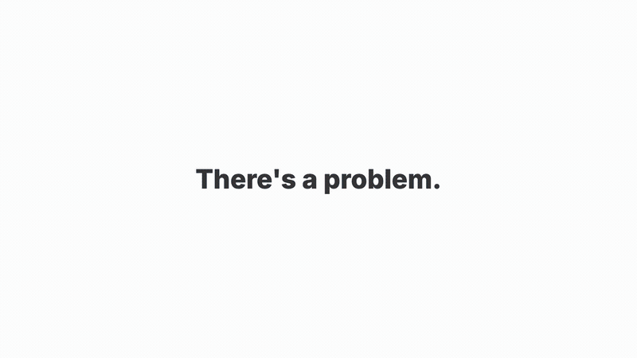

# cc-retrospect

[](https://github.com/vaddisrinivas/cc-retrospect/actions)
[](LICENSE)
[](https://www.python.org/)

**Know what your Claude Code sessions actually cost.**

<p align="center">
  
</p>

Claude Code doesn't show what you're spending. No cost dashboard, no warning at 300 tool calls, no signal you used Opus for a task Sonnet could handle. cc-retrospect fixes that.

> **v3.0.0-rc** — Tool call history browser, Magic Create script generator, STYLE.md live sync, chain pattern analysis, 5 themes, command palette.

---

## Install

In Claude Code:

```
/marketplace add vaddisrinivas/cc-retrospect
/install cc-retrospect@cc-retrospect
```

That's it. Hooks auto-register. Dashboard starts on first `/cc-retrospect:dashboard`.

<details>
<summary>Git clone (alternative)</summary>

```bash
git clone https://github.com/vaddisrinivas/cc-retrospect ~/.claude/plugins/cc-retrospect
cd ~/.claude/plugins/cc-retrospect && pip install -e .
```
</details>

<details>
<summary>Update</summary>

```
/install cc-retrospect@cc-retrospect
```

Or: `cd ~/.claude/plugins/cc-retrospect && git pull && pip install -e .`
</details>

---

## Features

### Dashboard

Live dashboard at `localhost:7731` — open with `/cc-retrospect:dashboard`.

| Feature | Details |
|---------|---------|
| **Budget tracking** | Real-time spend gauge, 3 alert tiers (warning/critical/severe), 7-day sparkline, macOS notifications |
| **AI savings tips** | Actionable tips with $/mo projections — model switching, session length, agent replacement |
| **Session grading** | Every session scored A–D on efficiency, cost velocity, cache rate, waste patterns |
| **Grade streak** | Consecutive A-grade counter — gamifies good habits |
| **Daily cost chart** | Stacked bar by model (Opus/Sonnet/Haiku) per day |
| **Model split donut** | Visual breakdown of spend by model |
| **Cost by project** | Horizontal bars ranked by spend |
| **Week-over-week badges** | Cost, sessions, frustrations, avg duration — % change from last week |
| **Session table** | Searchable, sortable, filterable by project/grade/model/date |
| **Session expansion** | Click any row to see full session details inline |
| **Activity heatmap** | Sessions by hour × day-of-week, click to filter |
| **Tool usage chart** | Bar chart of tool calls, click any tool to filter sessions |
| **Frustration tracking** | Word cloud of frustration signals (no, again, ugh, wrong, sigh) |
| **Tool call browser** | Browse every tool call across sessions — filter by tool, errors only |
| **Chain pattern analysis** | Most-used tool chains ranked by frequency and depth |
| **Period comparison** | Any two date ranges side-by-side with % change on all metrics |
| **Profile card** | Developer archetype, trait scores, fun facts — export as PNG, animated GIF, or clipboard |
| **AI insights** | Claude-powered analysis of session patterns (on demand) |
| **Saved reports** | Timestamped snapshots with open/load buttons |
| **Intervention badges** | Repetitive chains, oversized prompts flagged with WASTE badges |
| **Config editor** | Edit `config.env` directly from the dashboard |

### Themes & UI

| Feature | Details |
|---------|---------|
| **5 themes** | Dark, Light, Nord, Solarized, Cyberpunk — press `d` to cycle |
| **Command palette** | `⌘K` / `Ctrl+K` — searchable command list with 17 actions |
| **Keyboard shortcuts** | `1-6` jump sections, `/` search, `r` refresh, `↑↓` navigate, `Enter` expand |
| **Glass morphism** | Backdrop blur, ambient orbs, fractal noise overlay |
| **GSAP animations** | ScrollTrigger entrance animations on all sections |
| **Responsive** | Breakpoints at 1100px and 700px |
| **Sidebar collapse** | Toggle with hamburger menu |

### Passive Hooks (7 hooks, always running, invisible)

| Hook | What it does |
|------|-------------|
| **Session end** | Cache cost/tokens/tools, track daily spend, log waste flags, update trends, auto-sync STYLE.md |
| **Session start** | Show last-session recap, daily digest (once/day), tips if thresholds exceeded |
| **Pre-tool** | Warn on GitHub WebFetch (use `gh`), Agent for simple searches (use Grep) |
| **Post-tool** | Dual-tier compact nudge (150+/300+ calls), auto-compact option, model nudge for simple tasks |
| **User prompt** | Detect mega-pastes (>1000 chars) and oversized prompts |
| **Pre-compact** | Log compaction with token counts |
| **Post-compact** | Record compaction results |

### Hook Behaviors

| Behavior | Details |
|----------|---------|
| **Dual-tier compact nudge** | First nudge at 150 calls (suggestion), second at 300 (auto-fires `/compact` if enabled) |
| **Model nudge** | Suggests Haiku/Sonnet when Opus used for Read/Edit/Grep-only sessions after 10+ calls |
| **Bash chain warning** | Flags 6+ consecutive Bash calls — suggests combining with `&&` |
| **Subagent warning** | Flags Agent spawns that could be direct Grep/Glob |
| **Mega-prompt detection** | Warns on prompts >1000 chars that could be split |
| **Daily digest dedup** | Digest shown once per day, not every session |
| **Weekly trend auto-update** | Backfills missing weeks on session start |

### Magic Create

Select tool calls → Claude generates a reusable script.

| Feature | Details |
|---------|---------|
| **3 scopes** | Selected calls only, this project, cross-project portable |
| **Structured output** | Claude returns JSON (`description`, `when_to_use`, `script`) |
| **Auto-save** | Scripts saved to `~/.claude/plugins/generated_scripts/` |
| **STYLE.md integration** | One-liner appended so Claude knows when to suggest the script |

### Commands (instant, no AI tokens)

```
/cc-retrospect:dashboard   Open live dashboard
/cc-retrospect:cost        Cost breakdown by project, model, time
/cc-retrospect:habits      Usage patterns, peak hours, tool usage
/cc-retrospect:health      Session discipline, frustration patterns
/cc-retrospect:waste       Token waste detection
/cc-retrospect:compare     This week vs last week
/cc-retrospect:trends      Weekly trend tracking
/cc-retrospect:savings     Per-habit savings projections
/cc-retrospect:model       Model efficiency analysis
/cc-retrospect:tips        Context-aware tips
/cc-retrospect:digest      Yesterday's summary
/cc-retrospect:chains      Tool chain pattern analysis
/cc-retrospect:export      JSON export of all sessions
/cc-retrospect:learn       Generate STYLE.md from your history
/cc-retrospect:status      Plugin health check
/cc-retrospect:config      Show config values
/cc-retrospect:reset       Clear cache, force re-scan
/cc-retrospect:uninstall   Remove hooks
```

### AI-Powered Skill

```
/cc-retrospect              Full retrospective with reasoning
/cc-retrospect waste        Deep waste analysis + root causes
/cc-retrospect health       Health deep-dive
/cc-retrospect savings      Prioritized savings with $ amounts
/cc-retrospect model        Per-project model routing table
/cc-retrospect profile      Behavioral profile + archetype
/cc-retrospect habits       Session patterns + peak hours
/cc-retrospect compare      Week-over-week with reasoning
/cc-retrospect trends       Trend analysis over time
/cc-retrospect tips         1-3 actionable tips
/cc-retrospect report       Full markdown report
/cc-retrospect learn        Generate STYLE.md + LEARNINGS.md
```

### Configuration

Override in `~/.cc-retrospect/config.env`:

```env
# Budget alert tiers
THRESHOLDS__DAILY_COST_WARNING=75.0
THRESHOLDS__DAILY_COST_CRITICAL=200.0
THRESHOLDS__DAILY_COST_SEVERE=400.0

# Compact nudge thresholds
THRESHOLDS__COMPACT_NUDGE_FIRST=150
THRESHOLDS__COMPACT_NUDGE_SECOND=300

# Toggle hooks
HINTS__SESSION_START=true
HINTS__PRE_TOOL=true
HINTS__POST_TOOL=true
HINTS__AUTO_COMPACT=true
HINTS__MODEL_NUDGE=true
HINTS__DIGEST_ON_START=false

# Exclude projects from analysis
FILTER__EXCLUDE_ENTRYPOINTS=["cc-retrospect","cc-later"]

# Per-project threshold overrides
THRESHOLDS__PROJECT_OVERRIDES={"my-project": {"daily_cost_warning": 50.0}}

# Magic Create
MAGIC_CREATE__SAVE_DIR=~/.claude/plugins/generated_scripts
MAGIC_CREATE__MODEL=claude-sonnet-4-6

# Custom analyzers (drop .py files in this dir)
# CUSTOM_ANALYZERS_DIR=~/.cc-retrospect/analyzers/
```

### Export

| Format | How |
|--------|-----|
| **CSV** | Header button in dashboard |
| **JSON** | Header button or `/cc-retrospect:export` |
| **PNG** | Profile card → Save PNG |
| **GIF** | Profile card → Save GIF (animated) |
| **Clipboard** | Profile card → Copy |
| **Reports** | Timestamped snapshots saved in `~/.cc-retrospect/reports/` |

---

## API Endpoints

All on `127.0.0.1:7731`:

| Endpoint | Method | Description |
|----------|--------|-------------|
| `/` | GET | Dashboard HTML |
| `/data.js` | GET | Current data payload |
| `/api/reload` | POST | Regenerate data |
| `/api/config` | GET/POST | Read/write config.env |
| `/api/sessions` | GET | Sessions as JSON |
| `/api/health` | GET | Server health |
| `/api/reports` | GET | List snapshots |
| `/api/toolcalls` | GET | Tool call history |
| `/api/chains` | GET | Chain patterns |
| `/api/style` | GET | STYLE.md content |
| `/api/style/sync` | POST | Sync STYLE.md |
| `/api/style/generate` | POST | Regenerate STYLE.md |
| `/api/magic-create` | POST | Generate script from calls |
| `/api/scripts` | GET | List generated scripts |

---

## Architecture

```
cc_retrospect/
  config.py               Config models (Pydantic)
  models.py               SessionSummary, AnalysisResult, ToolCall
  parsers.py              JSONL parsing, cost computation
  cache.py                Session cache, atomic writes
  analyzers.py            9 analyzers
  hooks.py                7 hooks
  commands.py             17 commands
  dashboard.py            Data payload generation
  dashboard_server.py     HTTP daemon on 127.0.0.1:7731
  dashboard_template.html Dashboard UI
  learn.py                STYLE.md generation
  core.py                 Re-export shim
```

## Data & Privacy

Reads `~/.claude/projects/` — the JSONL files Claude Code already writes. No network calls, no telemetry, no external services. Cache at `~/.cc-retrospect/`.

## Documentation

- [Commands](docs/commands.md)
- [Configuration](docs/configuration.md)
- [Architecture](docs/architecture.md)
- [Troubleshooting](docs/troubleshooting.md)
- [Contributing](CONTRIBUTING.md)

---

*Demo video made with [framecraft](https://github.com/vaddisrinivas/framecraft) — `/marketplace add vaddisrinivas/framecraft`*
